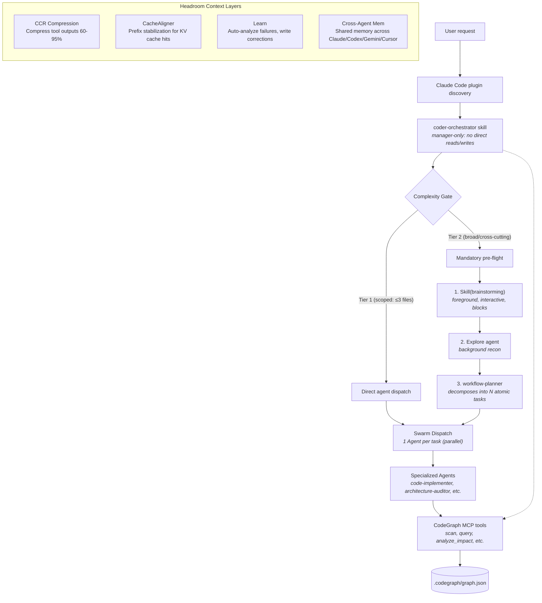

# Coder Workflow

**Coder Workflow** is a Claude Code plugin and CLI toolkit for disciplined software engineering workflows: single-orchestrator routing, graph-first codebase understanding, specialized coding agents, safety hooks, and a CodeGraph MCP server.

The orchestrator acts as a **strict top-level manager** — it never reads files or edits code directly. All work is delegated to specialized subagents. Complex, broad requests go through a mandatory pre-flight (Brainstorm → Explore → Plan) before any implementation agent fires.

Designed for teams or solo developers who want Claude Code to behave like a structured engineering workflow rather than an ad-hoc chat assistant.

---

## What It Provides

- **Strict orchestrator model** — `coder-orchestrator` is a top-level manager that never reads files or edits code directly. All execution is delegated to specialized subagents.
- **Two-tier Complexity Gate** — scoped requests (≤3 named files) dispatch immediately; broad/cross-cutting requests run a mandatory Brainstorm → Explore → Plan pre-flight before any implementation agent fires.
- **Foreground brainstorming** — `Skill(brainstorming)` runs as an interactive, blocking skill in the main context, asking one question at a time and requiring user approval before planning begins.
- **Graph-first codebase understanding** — CodeGraph MCP tools prefer dependency/call-graph queries over raw grep.
- **Specialized engineering agents** — planner, implementer, reviewer, debugger, tester, docs, UI, DB, DevOps, refactorer, auditor, and more.
- **Lifecycle hooks** — session startup, safety guards, graph refresh, task reminders, git operation warnings, and session summaries.
- **CLI + MCP server** — `coder-workflow` provides local commands and a stdio MCP server for Claude Code.
- **Persistent graph cache** — `.codegraph/graph.json` stores file/symbol/edge relationships using JSON.
- **Safety and verification** — dry-run CLI support, MCP health check, build checksums, CI matrix, and test coverage integration.

---

## Architecture at a Glance



---

## Installation

### Global install

Installs to `~/.claude/skills/coder-workflow/`, builds the CLI, and configures MCP.

```bash
./install.sh
```

### Development symlink

Use this when actively editing the plugin repository.

```bash
./install.sh --link
```

### Project-local install

Installs into the current project only.

```bash
./install.sh --project
```

### MCP-only install

```bash
./install.sh --mcp-only
```

After installation, restart Claude Code or run:

```text
/reload-plugins
```

---

## MCP Configuration

The plugin ships with `.mcp.json`:

```json
{
  "mcpServers": {
    "codegraph": {
      "type": "stdio",
      "command": "coder-workflow",
      "args": ["mcp"],
      "env": {
        "CODEGRAPH_DEFAULT_UI_PORT": "3737"
      }
    }
  }
}
```

Start the MCP server directly:

```bash
npm run start:mcp
# or
coder-workflow mcp
```

Health check through MCP is available as the `ping` tool. It reports server status, uptime, tool call count, cache state, and graph lock state.

---

## CLI Usage

```bash
coder-workflow help
```

Common commands:

```bash
# Build or refresh graph database
coder-workflow scan

# Preview scan output without writing .codegraph/graph.json
coder-workflow scan --dry-run

# Incremental update
coder-workflow update

# Query graph relationships
coder-workflow query "GraphDatabase"

# Analyze impact radius
coder-workflow impact "src/graph/db.ts"

# Search source text
coder-workflow search "TODO|FIXME" --regex --context 2

# Find cycles and orphans
coder-workflow cycles
coder-workflow orphans

# Architecture and quality
coder-workflow summary
coder-workflow quality --fail-on high

# Export graph artifacts
coder-workflow export json mermaid html

# Compare graph JSON snapshots
coder-workflow diff before.json after.json

# UI / dashboard
coder-workflow ui
coder-workflow dashboard

# ── Headroom Features ──────────────────────────────────────────────

# Compress JSON/code/prose output (60-95% token reduction)
echo '{"long": "json..."}' | coder-workflow compress --json
coder-workflow ccr-stats
coder-workflow ccr-clean 24

# Align content for KV cache optimization
echo "prompt text" | coder-workflow align-cache --type agent --sub-type implementer
coder-workflow cache-stats

# Analyze failures and auto-generate corrections
coder-workflow learn-analyze
coder-workflow learn-analyze --apply   # write corrections to memory
coder-workflow learn-report

# Cross-agent memory operations
coder-workflow memory-store --name "bug-pattern" \
  --description "How to fix X" \
  --content "Fix steps here..." \
  --agent "alice" --type lesson --tags "bug,pattern"
coder-workflow memory-query --search "bug"
coder-workflow memory-stats
coder-workflow memory-export
coder-workflow memory-platforms
```

---

## Skills

When loaded as a Claude Code plugin, skills are namespaced as `/coder-workflow:<skill>`.

| Skill | Purpose |
|---|---|
| `/coder-workflow:coder-orchestrator` | Required entry point for coding tasks; routes work to the right agents. |
| `/coder-workflow:coder-workflow` | Main user-facing coding workflow trigger. |
| `/coder-workflow:plan` | Decompose a coding request into scoped tasks. |
| `/coder-workflow:audit` | Read-only architecture and layer violation audit. |
| `/coder-workflow:refraktor` | Refactor toward Modular MVC + Service + Repository. |
| `/coder-workflow:debug` | Root-cause analysis for bugs and failures. |
| `/coder-workflow:test` | Test strategy, scaffolding, and coverage. |
| `/coder-workflow:review` | Security and edge-case review. |
| `/coder-workflow:deploy` | Docker, CI/CD, GHCR, Traefik, VPS deployment workflows. |
| `/coder-workflow:ui` | Frontend UI, CSS, state, and accessibility work. |
| `/coder-workflow:db` | Schema, migration, indexing, and query optimization work. |
| `/coder-workflow:docs` | README, API specs, inline docs, and PR docs. |
| `/coder-workflow:diagram` | Mermaid diagrams from codebase graph data. |
| `/coder-workflow:memory` | Long-term agentic memory operations. |
| `/coder-workflow:multirepo` | Multi-repository contract and architecture coordination. |
| `/coder-workflow:timetravel` | Auto-bisect / rollback investigation. |
| `/coder-workflow:brainstorming` | Clarify requirements before creative or underspecified work. |
| `/coder-workflow:dispatching-parallel-agents` | Force aggressive parallel decomposition where safe. |
| `/coder-workflow:writing-skills` | Build or verify Claude Code skills. |

---

## Agents

Agent metadata is centralized in `agents/registry.json`.

| Agent | Role |
|---|---|
| `workflow-planner` | Task decomposition and dependency ordering. |
| `code-implementer` | Scoped implementation after planning. |
| `architecture-auditor` | Read-only architecture and layer audit. |
| `code-reviewer` | Security, correctness, and edge-case review. |
| `debugging-engineer` | Root-cause analysis and bug tracing. |
| `test-engineer` | Test scaffolding and coverage analysis. |
| `refactoring-engineer` | Structural refactors and modular architecture. |
| `devops-engineer` | Docker, CI/CD, registry, VPS, Traefik. |
| `docs-engineer` | Documentation synchronization. |
| `ui-engineer` | Frontend UI and accessibility. |
| `db-architect` | Database schema and query work. |
| `todo-checker` | TODO/FIXME/dummy-code scan. |
| `diagram-engineer` | Mermaid architecture diagrams. |
| `rollback-engineer` | Git bisect and rollback investigation. |
| `memory-librarian` | Long-term memory lookup and storage. |
| `multi-repo-orchestrator` | Cross-repository coordination. |

---

## Hooks

Hooks live in `hooks/hooks.json` with companion scripts in `hooks/scripts/`.

Major hook capabilities:

- **Session startup** — banner, graph status, plugin conflict detection, auto-scan if needed.
- **Prompt submission** — skill detection and prompt logging.
- **Safety guards** — dangerous `rm`, force-push to main/master, hard reset, destructive SQL, unsafe `.env` writes.
- **Write/Edit handling** — impact-radius reminder and debounced graph update.
- **Git operation awareness** — branch switch, merge, push, commit notices.
- **Subagent depth tracking** — warns when nesting exceeds the safe depth limit.
- **Stop hook** — waits for graph updates before auto-commit/session summary.
- **Log rotation** — trims oversized session logs.
- **Hook JSON validation helpers** — `hooks/scripts/validate-hook-json.sh`.

---

## CodeGraph MCP Tools

| Tool | Purpose |
|---|---|
| `scan_codebase` | Full graph scan and database refresh. |
| `update_codebase` | Update only changed files. |
| `query_graph` | Query definitions, references, calls, imports, routes, handlers. |
| `analyze_impact` | Upstream/downstream impact analysis. |
| `search_code` | Source text search with regex/context filters. |
| `find_cycles` | Detect circular dependencies. |
| `find_orphans` | Identify orphan files/symbols. |
| `summarize_architecture` | Architecture summary and hotspots. |
| `analyze_quality` | Graph quality analysis. |
| `quality_gate` | Threshold-based quality gate. |
| `export_graph` | Export JSON, Mermaid, DOT, Markdown, HTML. |
| `summarize_graph` | Bounded graph summary for token budgets. |
| `check_graph_freshness` | Graph DB freshness check. |
| `diff_graphs` | Compare graph snapshots. |
| `list_directory_tree` | Directory tree visualization. |
| `open_graph_ui` | Start local graph UI. |
| `ping` | MCP server health check. |

### Headroom MCP Tools (Context Optimization)

| Tool | Purpose |
|---|---|
| `compress_content` | CCR compress JSON/code/prose, store original for retrieval. |
| `decompress_content` | Restore original content by CCR ID. |
| `ccr_stats` | Compression statistics and storage usage. |
| `clean_ccr` | Purge expired compressed content. |
| `align_cache` | Wrap content in stable prefix for KV cache optimization. |
| `cache_alignment_stats` | Current prefix and warmup status. |
| `analyze_failures` | Detect recurring error patterns, suggest corrections. |
| `learn_report` | Failure stats, active patterns, recent failures. |
| `log_failure` | Log a failure event for pattern mining. |
| `resolve_failure` | Mark failure as resolved. |
| `match_correction` | Find correction matching an error string. |
| `store_memory` | Cross-agent memory entry (Claude/Codex/Gemini/Cursor). |
| `query_memory` | Search memory by platform, agent, type, tags, text. |
| `memory_stats` | Memory store statistics and breakdown. |
| `export_memory_markdown` | Platform-agnostic Markdown export. |
| `sync_memory_platform` | Sync entries from another platform's directory. |
| `supported_platforms` | List supported agent platforms. |

---

## Development

```bash
# Install dependencies
npm ci

# Build CLI + MCP + tests
npm run build

# Typecheck
npm run typecheck

# Run tests with coverage threshold
npm run test

# Lint / format
npm run lint
npm run format
npm run check

# Scan current repository
npm run scan

# Open graph UI
npm run ui

# Start dashboard
npm run dashboard
```

Build output includes `dist/MANIFEST.json`, a SHA-256 checksum manifest for generated `.js` files.

---

## Verification

Recommended before publishing or pushing:

```bash
npm run typecheck
npm run build
node --test dist/test/graph.test.js
coder-workflow scan --dry-run
coder-workflow help
```

CI runs validation, build, typecheck, lint, and tests. Build/typecheck also run on a matrix of:

- Ubuntu
- Windows
- macOS

---

## Repository Layout

```text
coder-workflow/
├── .claude-plugin/plugin.json
├── .mcp.json
├── CLAUDE.md
├── README.md
├── package.json
├── esbuild.config.mjs
├── src/
│   ├── cli.ts
│   ├── mcp-server.ts
│   ├── compress.ts          🆕 Headroom CCR compression engine
│   ├── learn.ts             🆕 Headroom failure analysis & correction
│   ├── cache-aligner.ts     🆕 CacheAligner prefix stabilization
│   ├── cross-agent-memory.ts 🆕 Cross-platform memory store
│   ├── graph.ts
│   ├── graph/
│   ├── analysis/
│   ├── search.ts
│   ├── exporters.ts
│   └── ui.ts
├── skills/
│   ├── coder-orchestrator/
│   ├── brainstorming/
│   ├── dispatching-parallel-agents/
│   └── writing-skills/
├── agents/
│   ├── registry.json
│   ├── workflow-planner.md
│   ├── code-implementer.md
│   └── ...
├── commands/
├── hooks/
│   ├── hooks.json
│   └── scripts/
├── docs/
├── test/
├── install.sh
└── install.ps1
```

---

## Orchestrator Behavior

### Manager-Only Mandate

The `coder-orchestrator` skill is configured with `disallowed-tools: [Edit, Write, NotebookEdit, Read, Grep]`. It is a **strict top-level manager** — it cannot and does not read files, grep code, or make edits. Every piece of work is delegated to a subagent.

### Complexity Gate

Before dispatching any agent, the orchestrator classifies the request:

| Gate | Condition | Action |
|---|---|---|
| **Tier 1** (scoped) | ≤3 specific files/functions named explicitly | Direct agent dispatch via Routing Table |
| **Tier 2** (broad) | Codebase-wide, multiple concerns, no target named | Mandatory pre-flight sequence |

**Tier 2 Pre-flight (always in this order):**

1. `Skill(brainstorming)` — foreground, interactive, blocks the conversation. Asks one question at a time, proposes 2-3 approaches, gets user approval, writes a spec doc. **Never spawned as a background agent.**
2. `Explore agent` — background recon: maps structure, finds duplications, traces call paths.
3. `coder-workflow:workflow-planner` — decomposes findings into N atomic tasks with `FILE_MANIFEST` per task.
4. Swarm dispatch — 1 `Agent()` per task, all in parallel.

**Tier 2 trigger keywords:** `codebase`, `everywhere`, `semua`, `seluruh`, `all`, `project-wide`, multiple concerns combined (e.g. `atomic + DRY + logging`).

### Output Contract

Every orchestrator turn starts with:

```
↳ coder-orchestrator [T1|T2] → [agent-name(s)]: [one-sentence goal]
```

---

## Operating Principles

1. **Orchestrator is a manager, not a worker.** It never reads files or edits code directly — all execution goes through subagents.
2. **Classify scope before dispatching.** Tier 1 (scoped) = direct dispatch. Tier 2 (broad) = Brainstorm → Explore → Plan → Swarm.
3. **Brainstorm first for underspecified requests.** `Skill(brainstorming)` runs interactively in the main context — never as a background agent.
4. **Route all coding work through the orchestrator.** Every coding conversation must load `coder-orchestrator` first.
5. **Use graph tools before raw search.** `query_graph`, `analyze_impact`, and `semantic_search` over grep.
6. **1 task = 1 subagent.** Never batch tasks into a single agent.
7. **Keep graph state fresh after edits and git operations.**
8. **Verify targeted changes before completing work.**
9. **Avoid dummy code, suppressions, and band-aid fixes.**

---

## License

MIT
