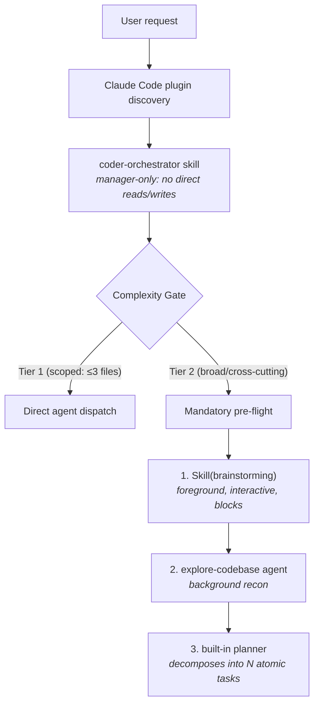

# Coder Workflow

**Coder Workflow** is a Claude Code plugin for disciplined software engineering workflows: single-orchestrator routing, specialized coding agents, and safety hooks.

The orchestrator acts as a **strict top-level manager** — it never reads files or edits code directly. All work is delegated to specialized subagents.

Designed for teams or solo developers who want Claude Code to behave like a structured engineering workflow rather than an ad-hoc chat assistant.

---

## What It Provides

- **Strict orchestrator model** — `coder-orchestrator` is a top-level manager that never reads files or edits code directly. All execution is delegated to specialized subagents.
- **Two-tier Complexity Gate** — scoped requests (≤3 named files) dispatch immediately; broad/cross-cutting requests run a mandatory Brainstorm → Explore → Plan pre-flight before any implementation agent fires.
- **Foreground brainstorming** — runs as an interactive, blocking skill in the main context, asking one question at a time and requiring user approval before planning begins.
- **Specialized engineering agents** — implementer, reviewer, debugger, tester, docs, UI, DB, DevOps, refactorer, auditor, and more.
- **Lifecycle hooks** — session startup, safety guards, task reminders, git operation warnings, and session summaries.
- **Safety and verification** — dry-run CLI support, build checksums, test coverage integration.

---

## Architecture at a Glance



---

## Quick Start

### Prerequisites

- [Claude Code](https://claude.ai/code) installed and authenticated
- Node.js 20+
- Git

### Install as Plugin

```bash
git clone <repo-url> coder-workflow
cd coder-workflow
./install.sh        # installs to ~/.claude/skills/coder-workflow/
```

For project-local install:
```bash
./install.sh --project   # installs to ./.claude/
```

### For Development

```bash
./install.sh --link  # symlinks for hot-reload development
```

After install: restart Claude Code or run `/reload-plugins`.

---

## Usage

Start any session by invoking the orchestrator:

```
/coder-workflow:coder-orchestrator
```

Or just start describing your task — the orchestrator handles routing:

- "Add a new API endpoint for user profiles"
- "Refactor the payment module to use repository pattern"
- "Deploy the app to production with Docker"
- "Debug the login timeout issue"
- "Audit the codebase for circular dependencies"

---

## Slash Commands

| Command | Description |
|---|---|
| `/coder-workflow` | Orchestrate all coding work |
| `/plan` | Task decomposition |
| `/audit` | Architecture audit |
| `/refraktor` | Refactor to Modular MVC |
| `/debug` | Root-cause debugging |
| `/test` | TDD test generation |
| `/review` | Code review |
| `/docs` | Documentation generation |
| `/deploy` | Docker/CI/CD deploy |
| `/secrets` | Scan secrets |
| `/vuln` | CVE scan |
| `/think` | Sequential thinking |

---

## Key Commands

```bash
# CLI is available after install:
coder-workflow --help
coder-workflow adr list
coder-workflow secrets scan .
coder-workflow vuln-scan
```

---

## Project Structure

```
coder-workflow/
├── skills/          # Orchestrator and meta-skills
├── agents/          # Specialized coding agents
├── commands/        # Slash command definitions
├── hooks/           # Safety and lifecycle hooks
├── src/             # TypeScript source (CLI)
├── docs/            # Documentation
├── .claude-plugin/  # Plugin manifest
├── install.sh       # Unix installer
└── install.ps1      # Windows installer
```

---

## License

MIT
